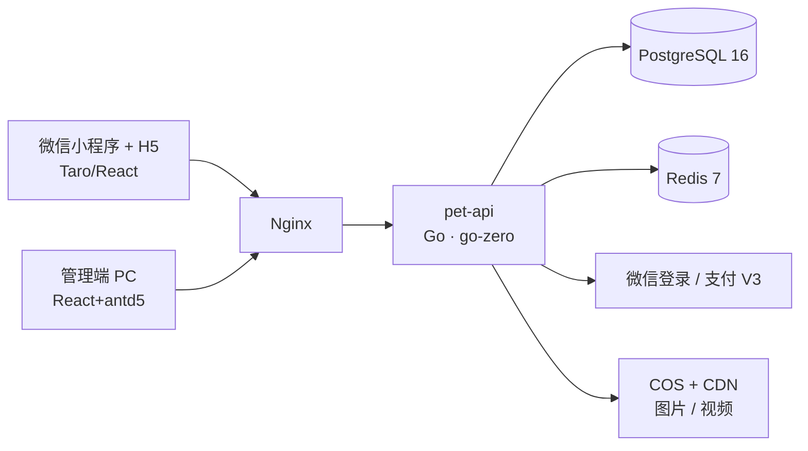

<div align="center">

# Pet

**宠物活体交易平台** · 微信小程序 / H5 一套代码 · PC 平台管理端 · Go 单体后端

[](https://go.dev)
[](https://github.com/zeromicro/go-zero)
[](https://taro-docs.jd.com)
[](https://react.dev)
[](https://www.postgresql.org)
[](https://redis.io)

[功能特性](#功能特性) · [快速开始](#快速开始) · [Docker 部署](#docker-部署) · [配置说明](#配置说明) · [文档导航](#文档导航) · [参与贡献](#参与贡献)

</div>

---

## 功能特性

**用户端（小程序 / H5，Taro 一套代码）**

- 手机号 + 短信验证码登录，微信授权登录（小程序 code2session / 公众号 H5 OAuth2，unionid 归并）
- 宠物商品列表 / 详情（图片轮播 + 视频播放 + 宠物档案：品种、年龄、疫苗等）
- 分类 / 品种浏览，收藏与取消收藏；商品搜索列表页（关键词 + 分类 + 排序）
- 确认下单（增值服务加购、配送/托运方式选择、地址簿收货地址、优惠券、定金锁宠开关、秒杀价自动生效、运费与金额明细实时计算）
- **购物车**（加购 / 勾选 / 批量合并结算，多商品一单）与 **SKU 规格**（规格 chips 选价，订单快照规格）
- **拼团**（N 人团拼团价，自动凑团 / 开团，超时未成团自动退款）与**到店自提**（支付后生成核销码，管理端扫码核销直达完成）
- 订单详情页：状态时间线（下单→支付→发货→送达→完成）、待支付倒计时、配送跟踪与售后进度
- 领券中心 / 我的优惠券（可用、锁定、已使用、已过期状态一目了然，积分兑换券确认兑换）
- 我的订单（状态筛选、待支付剩余时间、补尾款 / 去支付 / 确认收货 / 申请售后 / 撤销售后 / 去评价）
- 用户增长：每日签到积分、积分明细、积分兑券、邀请有礼（邀请码复制 + 双方得积分）、收货地址簿
- 首页限时秒杀专区（生效活动自动出现，秒杀价 + 剩余名额）
- 「我的」个人中心：我的评价 / 我的售后 / 我的优惠券 / 积分签到 / 邀请有礼 / 地址簿 / 收藏 / 消息等统一入口 + 退出登录
- 订单评价体系：一单一评（星级 + 文字 + 图片），详情页评分摘要与全部评价弹层，商家回复展示
- 评价三维评分（健康 / 品相 / 服务）+ **宠物档案**（品种 / 生日 / 体重 / 疫苗驱虫记录，到期自动推送提醒）
- 售后申请：已支付 / 已完成订单可发起退款（默认全额原路退回），进度与平台备注可见
- 人工客服实时聊天（文本 / 图片，WebSocket 推送 + 弱网自动重连、断线消息补拉）
- 微信订阅消息 / 公众号模板消息通知（客服回复 + 退款到账 / 关单 / 售后结果）
- 站内消息中心：通知列表（未读角标 / 单条已读 / 全部已读 / 下拉刷新）、优惠券到期自动提醒（3 天内到期恰好提醒一次）
- 搜索增强：热搜榜 + 搜索联想 + 个人搜索历史（7 天 / 10 条）；浏览历史（最近 50 个去重）与详情页「看了又看」推荐
- 会员等级：成长值 = 累计实付（V1 98 折 / V2 95 折 / V3 92 折），升级礼包券首达恰好发放，checkout 实时预览会员折扣
- 分享裂变：商品 / 首页分享卡片带邀请码参数，新注册自动归因双方得积分
- 电子健康证书：已完成订单开具精美证书页（证书编号 / 保障期 / 检疫证明预览），截图保存

**平台管理端（PC，React 18 + Ant Design 5）**

- 图形验证码登录，双端独立 JWT（30 分钟自动刷新轮换）
- 数据看板（在售 / 今日订单 / 今日 GMV / 会员数）
- 库存预警（在售库存 ≤ 阈值自动进入看板预警清单）
- 商品 CRUD（上下架、锁定 / 售出状态管控）、分类 / 品种管理
- 首页 Banner 运营位管理（跳转类型白名单 + 参数联动输入，移动端首页数据驱动渲染）
- 配送方式管理（到店自提 / 托运配送，运费、排序、启用停用，种子含专车 / 航空托运）
- 订单管理（详情含优惠/定金明细、退款、托运发货 / 标记送达、托运单打印）、会员管理（启用 / 禁用）
- 拼团活动管理（拼团价 / 成团人数 / 时限）、**自提核销**（6 位核销码校验，核销即完成）
- 秒杀活动管理（商品搜索选定、秒杀价 / 名额 / 时间窗、每商品至多一个启用中）
- 经营报表（今日 / 本月 GMV 与订单、近 N 天成交趋势、商品销量 Top10、品类分布）
- 平台合规：管理端操作审计日志（非读操作自动落库）、敏感词库（聊天拦截 + 评价/售后打码）
- 财务对账（交易流水 + 每日净收入汇总）、数据导出 CSV（订单 / 会员 / 积分，UTF-8 BOM 防乱码）、供货商管理（商品引用校验）
- 多角色 RBAC：super_admin / operator（运营，禁退款与账号管理）/ support（客服白名单），停用即时失效
- 售后管理（状态筛选、审核同意可调退款金额 / 拒绝须备注）、评价管理（隐藏 / 删除违规评价 / 官方回复）
- AI 知识库维护、营销管理（优惠券模板 / 增值服务 / 定向发放）
- 人工客服工作台（公共会话池、未读角标、双向实时收发、结束 / 自动重开会话）

**AI 智能客服（RAG）**

- 详情页「AI 问宠」：基于**平台知识库**（品种养护百科，管理端可维护）+ **这只宠物独有的档案**（性格/疫苗/健康等）检索增强问答
- 智能选宠推荐：按预算/家庭/生活习惯描述推荐 3 只（推荐分 + 理由），配置大模型走 LLM 推荐、未配置自动降级本地规则打分
- OpenAI 兼容接口，DeepSeek / 通义 / 智谱等开箱即接；未配置密钥时开发环境自动降级为演示模式
- 按用户频控（提问间隔 + 每日限额），回答附知识来源引用

**交易与可靠性**

- 微信支付 V3（JSAPI 下单、支付回调验签幂等、超时自动关单、退款）
- 订单状态机 + 数据库原子占位防超卖（同一活体仅一单可锁）；已支付订单超 7 天未确认自动完成（`Trade.AutoConfirmDays` 可调 / ≤0 关闭）；待支付超时自动关单（`Trade.PayTimeoutMinutes` 可调，默认 15 分钟）
- 定金锁宠：先付定金锁定活体，`10→15→20` 两段支付，尾款超时自动关单退定金；健康保障卡（加购服务携带保障天数，完成订单保障期内可售后）
- 秒杀：每商品至多一个启用中活动（部分唯一索引），名额原子抢占 / 关单回补，订单快照秒杀价
- 配送 / 托运：管理端维护配送方式，订单快照方式名与运费（券抵扣不含运费），发货 / 送达 CAS 子状态 + 订阅消息通知
- 用户增长：积分（签到 / 评价 / 订单 / 邀请 / 兑换，append-only 流水 + 余额守卫）、邀请归因双方得积分、积分兑券
- 会员等级：成长值只增不减（支付落账事务内累加），等级折扣在券后金额上计算、运费后加，升级礼包 `level_reached` 恰好一次；疫苗 / 驱虫到期关怀提醒（每日扫描，幂等投递）
- 营销自动化：购物车放弃提醒（N 小时未结算）与沉睡用户召回券（30 天未下单），notify 唯一键幂等、每 6 小时一轮
- 风控引擎：下单频控 / 评价联系方式拦截 / 会员黑名单（可登录禁交易），命中落 risk_log 供管理端审计
- 营销：优惠券（满减 / 折扣 / 立减 / 积分兑换，领券中心 + 管理端定向发放 + 注册赠送）与订单增值服务，券锁定防并发复用、关单自动回滚
- 售后退款走确定性退款单号幂等（`RF+售后单号`），审核 CAS 防并发、失败自动回滚重审
- 通知投递队列：biz_key 幂等 + `SKIP LOCKED` 取件 + 失败重试 / 未配置模板自动降级
- 运营保障：接口限流（下单 / 登录 / 短信 IP 日限，fail-open）、敏感词过滤、管理端操作审计、Prometheus `/metrics` 指标（业务事件计数）+ Docker Compose 一键 Prometheus / Grafana + 告警规则
- 敏感信息脱敏、错误码规范化、雪花 ID 主键

## 架构总览



详细设计（登录 / 支付时序、订单状态机、ER 图、API 全量清单）见 [文档导航](#文档导航)。

## 快速开始

### 环境要求

| 依赖 | 版本 |
| ---- | ---- |
| Go | 1.25+ |
| Node.js | 18+（包管理：npm / pnpm） |
| PostgreSQL | 16 |
| Redis | 7 |

### 本地开发

```bash
# 1. 建库 + 种子数据（管理员 admin / admin123456，示例分类品种商品）
psql -U pet -d pet -f scripts/sql/001_init.up.sql
psql -U pet -d pet -f scripts/sql/002_seed.up.sql
psql -U pet -d pet -f scripts/sql/003_ai_knowledge.up.sql
psql -U pet -d pet -f scripts/sql/004_marketing.up.sql
psql -U pet -d pet -f scripts/sql/005_chat.up.sql
psql -U pet -d pet -f scripts/sql/006_review.up.sql
psql -U pet -d pet -f scripts/sql/007_after_sale.up.sql
psql -U pet -d pet -f scripts/sql/008_notify.up.sql
psql -U pet -d pet -f scripts/sql/010_banner.up.sql
psql -U pet -d pet -f scripts/sql/011_review_reply.up.sql
psql -U pet -d pet -f scripts/sql/012_delivery.up.sql
psql -U pet -d pet -f scripts/sql/013_member_growth.up.sql
psql -U pet -d pet -f scripts/sql/014_trade_ext.up.sql
psql -U pet -d pet -f scripts/sql/015_ops.up.sql
psql -U pet -d pet -f scripts/sql/016_supplier_compliance.up.sql
psql -U pet -d pet -f scripts/sql/017_member_level.up.sql
psql -U pet -d pet -f scripts/sql/018_commerce_suite.up.sql

# 2. 后端（配置 backend/etc/pet-api.yaml，dev 模板开箱即用）→ :8888
cd backend && go run .

# 3. 管理端 → :5173（dev 已代理 /api → :8888）
cd frontend/apps/admin && npm install && npm run dev

# 4. 移动端 H5 → :10086（dev 已代理 /api）
cd frontend/apps/mobile && npm install && npm run dev:h5
```

> 开发模式短信不发真实短信：验证码见服务日志，或使用测试公共验证码 `888888`（仅非生产模式生效）。

## Docker 部署

单机一键编排：Nginx + pet-api + PostgreSQL 16 + Redis 7。

```bash
cd scripts/deploy

cp config/pet-api.yaml.example config/pet-api.yaml   # 占位符模板，一般无需改动
cp .env.example .env                                  # 填入全部密钥（勿提交）

docker compose up -d --build

# 初始化数据库
for f in 001_init 002_seed 003_ai_knowledge 004_marketing 005_chat 006_review 007_after_sale 008_notify 010_banner 011_review_reply 012_delivery 013_member_growth 014_trade_ext 015_ops 016_supplier_compliance 017_member_level 018_commerce_suite; do
  docker exec -i $(docker compose ps -q postgres) \
    psql -U pet -d pet -v ON_ERROR_STOP=1 < ../sql/$f.up.sql
done

# 可选：监控栈（Prometheus :9090 + Grafana :3001，数据源指向 prometheus:9090）
docker compose up -d prometheus grafana
```

配置注入链路：`.env` → compose `environment` → 容器环境变量 → `conf.UseEnv()` 展开 `pet-api.yaml` 中的 `${VAR}`。详见 [scripts/README.md](scripts/README.md)。

生产模式（`APP_MODE=pro`）启动校验：JWT 双 secret / 数据库 / Redis 缺失**拒绝启动**，`SMS_TEST_CODE` 非空**拒绝启动**。

## 配置说明

全部敏感配置经环境变量注入（[scripts/deploy/.env.example](scripts/deploy/.env.example)）：

| 变量 | 说明 | 默认值 |
| ---- | ---- | ------ |
| `APP_MODE` | 运行模式 dev / test / pro | `dev` |
| `AUTH_MEMBER_SECRET` | 用户端 JWT secret | 无（生产必填） |
| `AUTH_ADMIN_SECRET` | 平台端 JWT secret | 无（生产必填） |
| `POSTGRES_PASSWORD` | 数据库密码 | `pet_dev_123` |
| `REDIS_PASSWORD` | Redis 密码 | `redis_dev_123` |
| `WECHAT_MINI_APPID` / `WECHAT_MINI_SECRET` | 小程序登录 | 无 |
| `WECHAT_H5_APPID` / `WECHAT_H5_SECRET` | 公众号 H5 网页授权 | 无 |
| `WECHATPAY_MCH_ID` / `WECHATPAY_APIV3_KEY` / `WECHATPAY_SERIAL_NO` / `WECHATPAY_NOTIFY_URL` | 微信支付 V3 | 无 |
| `SMS_PROVIDER` | aliyun / tencent，留空不发真实短信 | 空 |
| `SMS_TEST_CODE` | 测试公共验证码（仅非生产生效） | `888888` |
| `COS_BUCKET` / `COS_REGION` / `COS_SECRET_ID` / `COS_SECRET_KEY` | 腾讯云 COS 直传 | 无 |
| `AI_BASE_URL` / `AI_API_KEY` / `AI_MODEL` | AI 问宠大模型（OpenAI 兼容接口，三项齐备启用；未配置时非生产为演示模式） | 无 |
| `WX_MINI_TMPL_CS_REPLY` / `WX_MINI_TMPL_ORDER` / `WX_MINI_TMPL_COUPON` / `WX_H5_TMPL_CS_REPLY` / `WX_H5_TMPL_ORDER` / `WX_H5_TMPL_COUPON` | 微信通知模板 ID（订阅/模板消息，未配置自动降级不发） | 无 |

> 微信登录 / 支付、COS 直传、真实短信通道需填入对应密钥后联调。

## 仓库结构

```
pet/
├── frontend/    # 前端 workspace（pnpm + turbo）
│   ├── apps/mobile    # Taro：微信小程序 + H5 一套代码
│   ├── apps/admin     # PC 平台管理端（React 19 + antd 5）
│   └── packages/      # @pet/api / @pet/utils / @pet/ui
├── backend/     # Go 后端：go-zero 单体服务 pet-api（auth/pet/favorite/trade/manage/ai/marketing/chat/review/aftersale/notify）
├── scripts/     # sql/（迁移·种子）、deploy/（Docker·Nginx）、dev/（本地辅助）
└── docs/        # 技术方案文档
```

## 文档导航

| 文档 | 内容 |
| ---- | ---- |
| [01-技术选型](docs/01-技术选型.md) | Go vs Java、Taro vs uni-app 评估结论与依赖清单 |
| [02-系统架构](docs/02-系统架构.md) | 总体架构图、登录/支付时序图、订单状态机、部署架构 |
| [03-数据库设计](docs/03-数据库设计.md) | ER 图、35 张表 DDL（商品/交易/配送/AI 知识库/营销/客服/评价/售后/通知/运营位/积分/秒杀/审计/敏感词/供货商/会员等级/购物车/SKU/拼团/宠物档案/风控）、防超卖事务、索引策略 |
| [04-API接口设计](docs/04-API接口设计.md) | 路由域、错误码、用户端/平台端全量接口、订阅消息说明、安全清单 |
| [05-前端设计](docs/05-前端设计.md) | Monorepo 结构、页面信息架构、UI 设计 Token |

## 路线图

| 里程碑 | 内容 | 状态 |
| ------ | ---- | ---- |
| M1 基础框架 | 服务骨架、PG 迁移、双端 JWT + 短信/微信登录 | ✅ 完成（实库验证） |
| M2 商品域 | 分类/品种/商品 CRUD、COS 直传、浏览收藏 | ✅ 完成（COS 待真实密钥联调） |
| M3 交易域 | 下单防超卖、微信支付、回调幂等、超时关单、退款 | ✅ 完成（支付待商户号联调） |
| M3.5 AI + 营销 | AI 问宠（知识库 RAG）、优惠券（满减/折扣/立减）与订单增值服务 | ✅ 完成（实库验证） |
| M3.6 评价 + 售后 + 通知 | 订单评价（一单一评）、用户侧售后（审核可调金额退款）、微信订阅/模板消息通知队列 | ✅ 完成（实库验证） |
| M3.7 交易闭环补全 | 站内消息中心（未读/全部已读）、超时自动确认收货（7 天可配）、优惠券到期提醒 | ✅ 完成（实库验证） |
| M3.8 增长与运营 | 定金锁宠、秒杀、健康保障卡、积分/邀请/地址簿、经营报表、审计/敏感词、接口限流、监控告警 | ✅ 完成（实库验证） |
| M3.9 商城深化 | 购物车、SKU 规格、拼团、自提核销、三维评分、宠物档案、库存预警、营销自动化、风控引擎 | ✅ 完成（迁移 018，实库验证） |
| M4 上线 | Docker 编排、监控告警、小程序审核发布 | ⏳ 编排与监控栈就绪，小程序待审核发布 |

## 参与贡献

欢迎 Issue 与 PR。提交前请阅读 [CONTRIBUTING.md](CONTRIBUTING.md)（提交规范、本地验证清单）。安全漏洞请勿公开提交，见 [SECURITY.md](SECURITY.md)。

行为准则见 [CODE_OF_CONDUCT.md](CODE_OF_CONDUCT.md)。

## 许可

本项目为商业项目，未附带开源许可。未经授权请勿复制、分发或商用。
