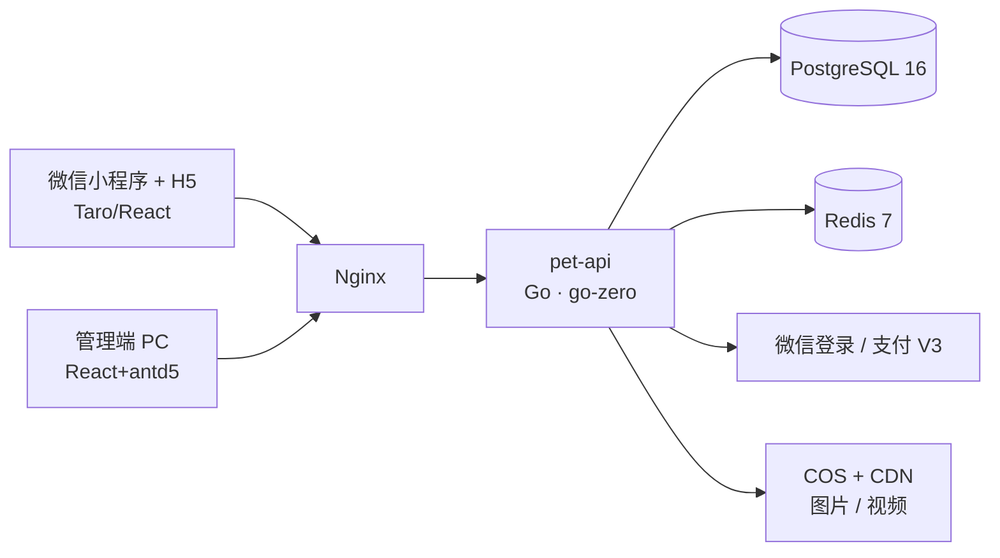

<div align="center">

# Pet

**宠物活体交易平台** · 微信小程序 / H5 一套代码 · PC 平台管理端 · Go 单体后端

[](https://go.dev)
[](https://github.com/zeromicro/go-zero)
[](https://taro-docs.jd.com)
[](https://react.dev)
[](https://www.postgresql.org)
[](https://redis.io)

[功能特性](#功能特性) · [快速开始](#快速开始) · [Docker 部署](#docker-部署) · [配置说明](#配置说明) · [文档导航](#文档导航) · [参与贡献](#参与贡献)

</div>

---

## 功能特性

**用户端（小程序 / H5，Taro 一套代码）**

- 手机号 + 短信验证码登录，微信授权登录（小程序 code2session / 公众号 H5 OAuth2，unionid 归并）
- 宠物商品列表 / 详情（图片轮播 + 视频播放 + 宠物档案：品种、年龄、疫苗等）
- 分类 / 品种浏览，收藏与取消收藏
- 确认下单（增值服务加购、优惠券选择、金额明细实时计算）
- 领券中心 / 我的优惠券（可用、锁定、已使用、已过期状态一目了然）

**平台管理端（PC，React 19 + Ant Design 5）**

- 图形验证码登录，双端独立 JWT（30 分钟自动刷新轮换）
- 数据看板（在售 / 今日订单 / 今日 GMV / 会员数）
- 商品 CRUD（上下架、锁定 / 售出状态管控）、分类 / 品种管理
- 订单管理（详情含优惠明细、退款）、会员管理（启用 / 禁用）
- AI 知识库维护、营销管理（优惠券模板 / 增值服务 / 定向发放）

**AI 智能客服（RAG）**

- 详情页「AI 问宠」：基于**平台知识库**（品种养护百科，管理端可维护）+ **这只宠物独有的档案**（性格/疫苗/健康等）检索增强问答
- OpenAI 兼容接口，DeepSeek / 通义 / 智谱等开箱即接；未配置密钥时开发环境自动降级为演示模式
- 按用户频控（提问间隔 + 每日限额），回答附知识来源引用

**交易与可靠性**

- 微信支付 V3（JSAPI 下单、支付回调验签幂等、超时自动关单、退款）
- 订单状态机 + 数据库原子占位防超卖（同一活体仅一单可锁）
- 营销：优惠券（满减 / 折扣 / 立减，领券中心 + 管理端定向发放 + 注册赠送）与订单增值服务，券锁定防并发复用、关单自动回滚
- 敏感信息脱敏、错误码规范化、雪花 ID 主键

## 架构总览



详细设计（登录 / 支付时序、订单状态机、ER 图、API 全量清单）见 [文档导航](#文档导航)。

## 快速开始

### 环境要求

| 依赖 | 版本 |
| ---- | ---- |
| Go | 1.25+ |
| Node.js | 18+（包管理：npm / pnpm） |
| PostgreSQL | 16 |
| Redis | 7 |

### 本地开发

```bash
# 1. 建库 + 种子数据（管理员 admin / admin123456，示例分类品种商品）
psql -U pet -d pet -f scripts/sql/001_init.up.sql
psql -U pet -d pet -f scripts/sql/002_seed.up.sql
psql -U pet -d pet -f scripts/sql/003_ai_knowledge.up.sql
psql -U pet -d pet -f scripts/sql/004_marketing.up.sql

# 2. 后端（配置 backend/etc/pet-api.yaml，dev 模板开箱即用）→ :8888
cd backend && go run .

# 3. 管理端 → :5173（dev 已代理 /api → :8888）
cd frontend/apps/admin && npm install && npm run dev

# 4. 移动端 H5 → :10086（dev 已代理 /api）
cd frontend/apps/mobile && npm install && npm run dev:h5
```

> 开发模式短信不发真实短信：验证码见服务日志，或使用测试公共验证码 `888888`（仅非生产模式生效）。

## Docker 部署

单机一键编排：Nginx + pet-api + PostgreSQL 16 + Redis 7。

```bash
cd scripts/deploy

cp config/pet-api.yaml.example config/pet-api.yaml   # 占位符模板，一般无需改动
cp .env.example .env                                  # 填入全部密钥（勿提交）

docker compose up -d --build

# 初始化数据库
for f in 001_init 002_seed 003_ai_knowledge 004_marketing; do
  docker exec -i $(docker compose ps -q postgres) \
    psql -U pet -d pet -v ON_ERROR_STOP=1 < ../sql/$f.up.sql
done
```

配置注入链路：`.env` → compose `environment` → 容器环境变量 → `conf.UseEnv()` 展开 `pet-api.yaml` 中的 `${VAR}`。详见 [scripts/README.md](scripts/README.md)。

生产模式（`APP_MODE=pro`）启动校验：JWT 双 secret / 数据库 / Redis 缺失**拒绝启动**，`SMS_TEST_CODE` 非空**拒绝启动**。

## 配置说明

全部敏感配置经环境变量注入（[scripts/deploy/.env.example](scripts/deploy/.env.example)）：

| 变量 | 说明 | 默认值 |
| ---- | ---- | ------ |
| `APP_MODE` | 运行模式 dev / test / pro | `dev` |
| `AUTH_MEMBER_SECRET` | 用户端 JWT secret | 无（生产必填） |
| `AUTH_ADMIN_SECRET` | 平台端 JWT secret | 无（生产必填） |
| `POSTGRES_PASSWORD` | 数据库密码 | `pet_dev_123` |
| `REDIS_PASSWORD` | Redis 密码 | `redis_dev_123` |
| `WECHAT_MINI_APPID` / `WECHAT_MINI_SECRET` | 小程序登录 | 无 |
| `WECHAT_H5_APPID` / `WECHAT_H5_SECRET` | 公众号 H5 网页授权 | 无 |
| `WECHATPAY_MCH_ID` / `WECHATPAY_APIV3_KEY` / `WECHATPAY_SERIAL_NO` / `WECHATPAY_NOTIFY_URL` | 微信支付 V3 | 无 |
| `SMS_PROVIDER` | aliyun / tencent，留空不发真实短信 | 空 |
| `SMS_TEST_CODE` | 测试公共验证码（仅非生产生效） | `888888` |
| `COS_BUCKET` / `COS_REGION` / `COS_SECRET_ID` / `COS_SECRET_KEY` | 腾讯云 COS 直传 | 无 |
| `AI_BASE_URL` / `AI_API_KEY` / `AI_MODEL` | AI 问宠大模型（OpenAI 兼容接口，三项齐备启用；未配置时非生产为演示模式） | 无 | |

> 微信登录 / 支付、COS 直传、真实短信通道需填入对应密钥后联调。

## 仓库结构

```
pet/
├── frontend/    # 前端 workspace（pnpm + turbo）
│   ├── apps/mobile    # Taro：微信小程序 + H5 一套代码
│   ├── apps/admin     # PC 平台管理端（React 19 + antd 5）
│   └── packages/      # @pet/api / @pet/utils / @pet/ui
├── backend/     # Go 后端：go-zero 单体服务 pet-api（auth/pet/favorite/trade/manage/ai/marketing）
├── scripts/     # sql/（迁移·种子）、deploy/（Docker·Nginx）、dev/（本地辅助）
└── docs/        # 技术方案文档
```

## 文档导航

| 文档 | 内容 |
| ---- | ---- |
| [01-技术选型](docs/01-技术选型.md) | Go vs Java、Taro vs uni-app 评估结论与依赖清单 |
| [02-系统架构](docs/02-系统架构.md) | 总体架构图、登录/支付时序图、订单状态机、部署架构 |
| [03-数据库设计](docs/03-数据库设计.md) | ER 图、15 张表 DDL（商品/交易/AI 知识库/营销）、防超卖事务、索引策略 |
| [04-API接口设计](docs/04-API接口设计.md) | 路由域、错误码、用户端/平台端全量接口、安全清单 |
| [05-前端设计](docs/05-前端设计.md) | Monorepo 结构、页面信息架构、UI 设计 Token |

## 路线图

| 里程碑 | 内容 | 状态 |
| ------ | ---- | ---- |
| M1 基础框架 | 服务骨架、PG 迁移、双端 JWT + 短信/微信登录 | ✅ 完成（实库验证） |
| M2 商品域 | 分类/品种/商品 CRUD、COS 直传、浏览收藏 | ✅ 完成（COS 待真实密钥联调） |
| M3 交易域 | 下单防超卖、微信支付、回调幂等、超时关单、退款 | ✅ 完成（支付待商户号联调） |
| M3.5 AI + 营销 | AI 问宠（知识库 RAG）、优惠券（满减/折扣/立减）与订单增值服务 | ✅ 完成（实库验证） |
| M4 上线 | Docker 编排、监控告警、小程序审核发布 | ⏳ 编排就绪，监控待接入 |

## 参与贡献

欢迎 Issue 与 PR。提交前请阅读 [CONTRIBUTING.md](CONTRIBUTING.md)（提交规范、本地验证清单）。安全漏洞请勿公开提交，见 [SECURITY.md](SECURITY.md)。

行为准则见 [CODE_OF_CONDUCT.md](CODE_OF_CONDUCT.md)。

## 许可

本项目为商业项目，未附带开源许可。未经授权请勿复制、分发或商用。
