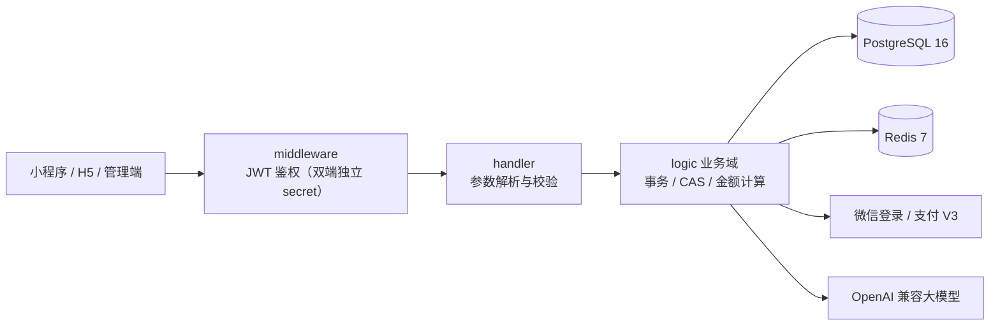

# backend · pet-api 后端服务

Go 1.25 + [go-zero](https://github.com/zeromicro/go-zero) 单体后端，同时承载用户端（小程序 / H5）与平台管理端全部业务域。单一部署单元，含 13 个业务域：`auth / pet / trade / favorite / ai / marketing / chat / review / aftersale / notify / growth / manage / ops`。

## 架构

### 技术栈

| 层 | 选型 |
| ---- | ---- |
| 框架 | go-zero rest（路由 / 中间件 / 配置 / 日志） |
| ORM | GORM + pgx driver，PostgreSQL 16 |
| 缓存 | Redis 7（验证码、频控、图形验证码） |
| 金额 | shopspring/decimal，落库 `NUMERIC(10,2)` |
| ID | 雪花算法主键 + 前缀业务单号 |
| 长连接 | coder/websocket（人工客服推送，进程内 Hub 连接注册表） |
| 外部 | 微信登录（code2session / OAuth2）、微信支付 V3、腾讯云 COS、OpenAI 兼容大模型 |

### 模块结构

```
backend/
├── pet.go              # 入口：加载配置（支持 ${ENV} 占位展开）、雪花初始化、注册路由、启动交易定时任务 + 通知投递器 + 券到期提醒 + 疫苗/驱虫到期提醒 + 营销自动化（购物车懒提醒/沉睡召回）
├── etc/
│   ├── pet-api.yaml    # 本地开发配置（明文 dev 值）
│   └── pet-api.test.yaml
└── internal/
    ├── config/         # 配置定义 + 生产模式启动校验
    ├── handler/        # 路由注册与请求处理
    ├── logic/          # 业务逻辑（按域分包）
    │   ├── auth/       # 短信 / 微信登录，双端独立 JWT + RefreshToken 轮换（登录支持分享带参 inviteCode 归因）
    │   ├── pet/        # 分类 / 品种 / 商品 / 收藏 / 首页 / 搜索增强（热搜·联想·历史）/ 浏览历史 / 相关推荐
    │   ├── trade/      # 下单防超卖、微信支付 V3、回调幂等、超时关单（PayTimeoutMinutes 可调）、定金锁宠 / 补尾款、秒杀价快照、地址簿、退款、配送方式 / 托运发货送达、购物车（加购/批量结算）、SKU 规格价、拼团（凑团/成团/超时退款）、自提核销码
    │   ├── marketing/  # 优惠券（满减/折扣/立减）、增值服务、金额计算、首页 Banner 运营位管理、营销自动化（购物车放弃提醒 / 沉睡用户召回券，notify 唯一键幂等）
    │   ├── ai/         # AI 问宠（知识库 RAG + 档案增强、频控）+ 智能选宠推荐（LLM 结构化推荐，未配置降级规则打分）
    │   ├── manage/     # 平台端：看板 / 商品（SKU/详情长图/库存预警阈值）/ 会员 / 秒杀 / 拼团 / 经营报表 / 审计日志 / 图形验证码 / 供货商 / 财务对账 / 数据导出 CSV / 自提核销 / 库存预警 / 风控记录 / 会员黑名单
    │   ├── chat/       # 人工客服：会话 / 消息 / 未读 / 已读，发送走 REST、WS 仅推送
    │   ├── review/     # 订单评价：一单一评（仅已完成单）、公开列表 / 评分摘要 / 我的评价、管理端隐藏 / 删除 / 官方回复
    │   ├── aftersale/  # 售后：申请（默认全额）/ 我的售后列表 / 撤销 / 审核（CAS + 可调金额退款，失败自动回滚重审）
    │   ├── notify/     # 通知：微信投递队列（客服回复/订单事件，biz_key 幂等、失败重试、未配置模板降级）+ 站内消息中心列表 / 单条已读 / 全部已读
    │   ├── growth/     # 用户增长：积分（签到/评价/订单/邀请/兑换，append-only 流水 + 余额守卫）、邀请码归因、地址簿、会员等级（成长值 / 等级折扣 / 升级礼包）、宠物档案（CRUD + 护理提醒数据源）
    │   ├── risk/       # 风控：下单频控（41902）/ 评价联系方式拦截（41903）/ 会员黑名单（41904），命中落 risk_log 留痕
    │   └── sensitive/  # 敏感词过滤（聊天拦截 41802、评价/售后打码 ***，60s 进程内缓存）
    ├── hub/            # 客服 WebSocket 连接注册表：多端推送、心跳判死（30s 预警 + 30s 宽限）
    ├── ratelimit/      # Redis 日限流（下单 / 登录 / 短信 IP / 演示支付，fail-open，超限 41801）
    ├── metrics/        # Prometheus 业务指标埋点（GET /metrics：订单 / 支付回调 / 通知投递 / 限流计数）
    ├── middleware/     # JWT 鉴权等中间件
    ├── model/          # GORM 模型（表结构见 scripts/sql）
    ├── svc/            # ServiceContext：DB / Redis / Hub / 微信 / AI 客户端
    ├── types/          # 请求 / 响应结构体（前后端契约，见 docs/04）
    └── common/         # 业务错误码、雪花 ID、业务单号
```

### 请求链路



后台任务：`trade.StartOrderCloser` 启动即跑一轮、此后每分钟扫描超时未支付订单（事务内关单并回滚库存与优惠券）、超时未确认订单（CAS 自动完成，`Trade.AutoConfirmDays` ≤0 关闭）与**超时未成团的拼团**（置失败 + 已支付订单整单退款）；`notify.StartNotifier` 每 10s 扫描通知投递队列（`FOR UPDATE SKIP LOCKED` 单行取件，多实例不重复投递）；`marketing.StartCouponReminders` 启动即跑一轮、此后每 30 分钟把 3 天内到期的可用券入通知队列（biz_key 恰好一次）并批量置已过期的可用券为过期；`pet.StartVaccineReminders` 启动即跑一轮、此后每 24 小时扫描疫苗 / 驱虫 7 天内到期的商品与**用户宠物档案**，幂等投递关怀提醒；`marketing.StartAutomation` 每 6 小时一轮营销自动化（购物车放弃提醒 / 沉睡用户召回券 5120，`Automation.*` 配置，≤0 关闭）。

管理端鉴权：`adminAuth` 按请求查库校验角色与启用状态，三角色 RBAC —— `super_admin` 全部权限、`operator` 禁退款 / 会员与账号写操作、`support` 仅客服会话白名单 + 看板 / 订单 / 评价只读，越权 403，停用账号即时失效。

## 本地开发

依赖：Go 1.25+、PostgreSQL 16、Redis 7（默认连 `127.0.0.1:5432` / `127.0.0.1:6379`，可在 `etc/pet-api.yaml` 调整）。

```bash
# 1. 初始化数据库（在仓库根执行，共 19 个迁移）
psql -U pet -d pet -f scripts/sql/001_init.up.sql
psql -U pet -d pet -f scripts/sql/002_seed.up.sql
psql -U pet -d pet -f scripts/sql/003_ai_knowledge.up.sql
psql -U pet -d pet -f scripts/sql/004_marketing.up.sql
psql -U pet -d pet -f scripts/sql/005_chat.up.sql
psql -U pet -d pet -f scripts/sql/006_review.up.sql
psql -U pet -d pet -f scripts/sql/007_after_sale.up.sql
psql -U pet -d pet -f scripts/sql/008_notify.up.sql
psql -U pet -d pet -f scripts/sql/010_banner.up.sql
psql -U pet -d pet -f scripts/sql/011_review_reply.up.sql
psql -U pet -d pet -f scripts/sql/012_delivery.up.sql
psql -U pet -d pet -f scripts/sql/013_member_growth.up.sql
psql -U pet -d pet -f scripts/sql/014_trade_ext.up.sql
psql -U pet -d pet -f scripts/sql/015_ops.up.sql
psql -U pet -d pet -f scripts/sql/016_supplier_compliance.up.sql
psql -U pet -d pet -f scripts/sql/017_member_level.up.sql
psql -U pet -d pet -f scripts/sql/018_commerce_suite.up.sql
psql -U pet -d pet -f scripts/sql/019_compliance_engagement.up.sql

# 2. 运行（默认读取 etc/pet-api.yaml，监听 :8888）
go run .
# 或指定配置
go run . -f etc/pet-api.test.yaml
```

接口自检：`curl http://127.0.0.1:8888/api/home`。dev 模式短信不发真实短信，验证码见服务日志，或用测试公共验证码 `888888`。

监控指标：`GET /metrics` 暴露 Prometheus 业务指标（订单事件 / 支付回调 / 通知投递 / 限流命中 / 请求时延直方图），告警规则与一键 Prometheus + Grafana 编排见 [scripts/deploy/monitoring/](../scripts/deploy/monitoring/)。

## 编译与打包

```bash
# 静态检查
go build ./... && go vet ./...

# 发布二进制（静态编译，可直接放容器 / 裸机）
CGO_ENABLED=0 GOOS=linux go build -ldflags="-s -w" -o bin/pet-api pet.go
./bin/pet-api -f etc/pet-api.yaml
```

## Docker 部署与编排

镜像由 [scripts/deploy/Dockerfile.api](../scripts/deploy/Dockerfile.api) 构建（多阶段：`golang:1.25-alpine` 构建 → `alpine:3.21` 运行时，非 root 用户，含时区与 CA），与 nginx / PostgreSQL / Redis 统一编排于 [scripts/deploy/docker-compose.yml](../scripts/deploy/docker-compose.yml)：

```bash
cd scripts/deploy
cp config/pet-api.yaml.example config/pet-api.yaml   # ${VAR} 占位模板
cp .env.example .env                                  # 填入全部密钥（勿提交）

docker compose up -d --build            # 全栈启动（nginx + api + pg + redis）
docker compose up -d --build api        # 仅重建 api
docker compose logs -f api              # 看日志
```

要点：

- **配置注入链路**：`.env` → compose `environment` → 容器环境变量 → 启动时 `conf.UseEnv()` 展开 `pet-api.yaml` 中 `${VAR}`；宿主机 `config/pet-api.yaml` 只读挂载到 `/app/etc/pet-api.yaml`
- **启动依赖**：compose 等 postgres / redis 健康检查通过后才启动 api
- **端口**：api 只绑定 `127.0.0.1:8888`，生产对外仅暴露 nginx 的 80/443
- **迁移**：镜像不含自动迁移，首次部署需手动应用 `scripts/sql/`（见 [scripts/README.md](../scripts/README.md)）

## 注意事项

- **生产启动校验**：`APP_MODE=pro` 时 JWT 双 secret / 数据库 / Redis 配置缺失**拒绝启动**；`SMS_TEST_CODE` 非空**拒绝启动**
- **金额一律走 decimal**：接口用元字符串（如 `"680.00"`），落库 `NUMERIC(10,2)`；实付金额唯一入口是 `order.PayAmount`，支付 / 回调 / 退款均由它派生，改动下单计算务必只动这一处
- **两套配置文件互不影响**：本地用 `etc/pet-api.yaml`（明文），部署用 `config/pet-api.yaml`（占位）；改配置结构时两边（含 example）需同步
- **雪花节点**：单机默认 `Snowflake.Node: 1`，若多实例部署必须保证节点号唯一
- **幂等**：微信支付回调以 `payment` 行状态 + 事务 CAS 保证重复通知安全；退款以 `payment` 既有成功退款记录短路 + 确定性退款单号（`RF+售后单号`）保证幂等；新增异步回调类逻辑请沿用该模式
- **数据库迁移为手工 psql**，无 auto-migrate；新表 / 新列需在 `scripts/sql/` 增加 `00N_*.up/down.sql` 并同步 [docs/03-数据库设计](../docs/03-数据库设计.md)
- **客服 WebSocket**：鉴权 token 走 query（会进访问日志），生产可对 `/api/ws/` 关闭 access log 或接受该风险；go-zero rest 超时对已升级的长连接无效，nginx 侧已配 `proxy_read_timeout 3600s`；小程序正式环境需 wss 合法域名（TLS 443）

