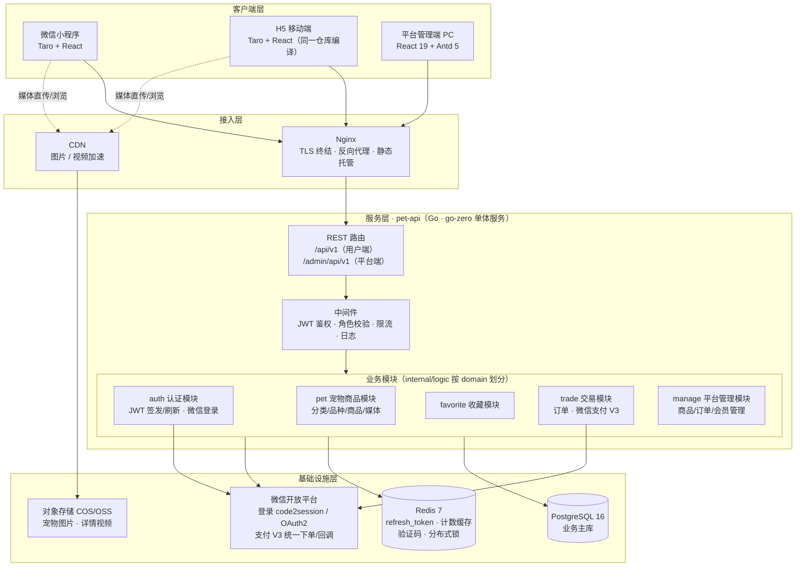
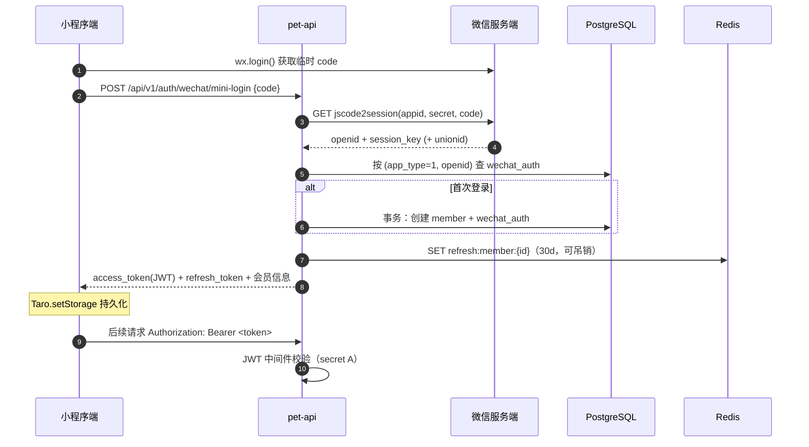
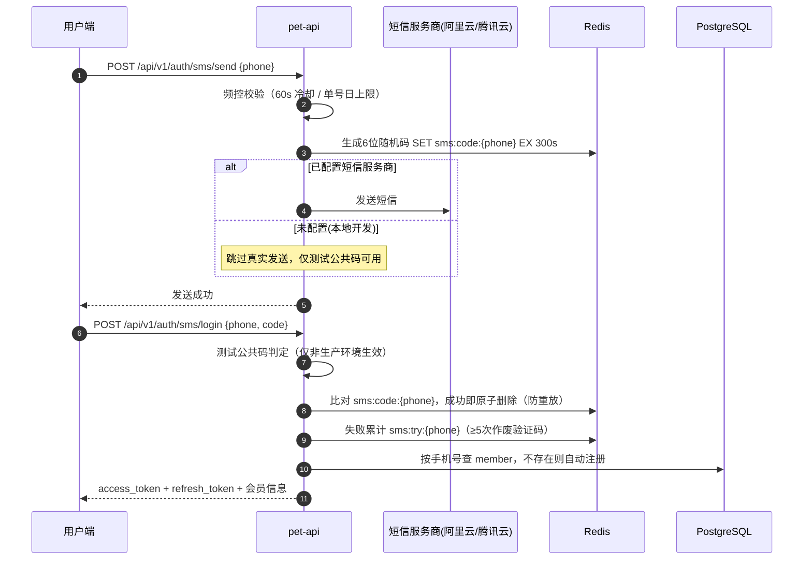
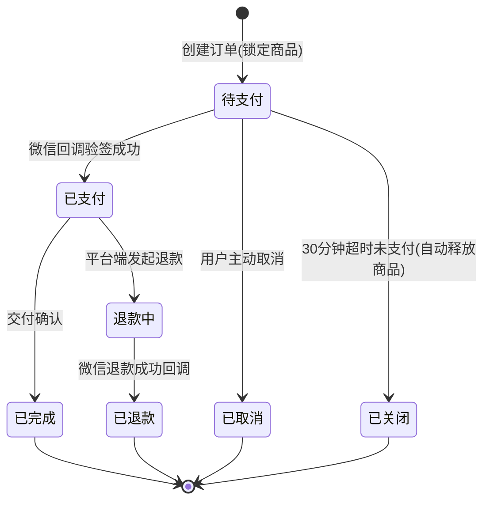
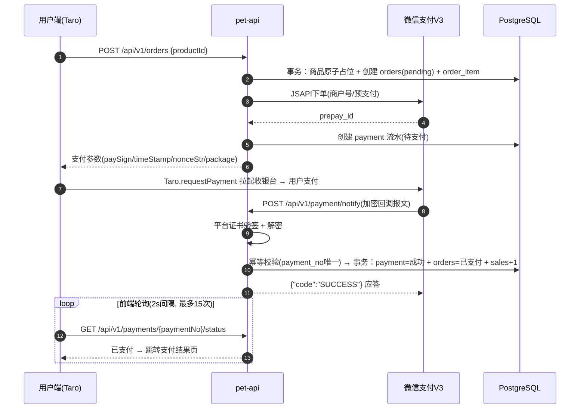
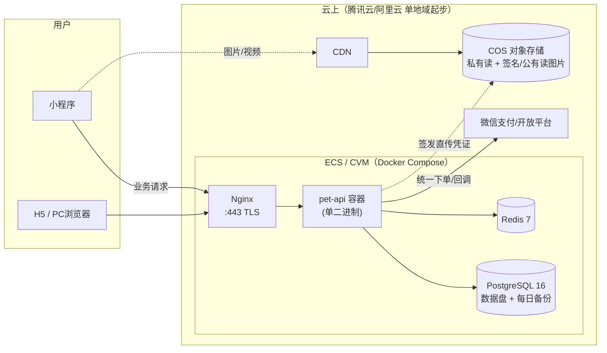

# 02 - 系统架构设计

> 宠物交易平台 · 架构设计文档

## 1. 总体架构图



**架构决策说明**

| 决策 | 说明 |
| ---- | ---- |
| 单体优先（Modular Monolith） | 当前业务域集中（商品/交易/收藏），单体 + 模块化分层交付最快；模块间通过 logic 接口调用而非直接跨包依赖，保留按域拆分为 RPC 服务的演进能力（与 awarelife 微服务体系衔接） |
| 单服务双路由域 | `/api/v1` 用户端、`/admin/api/v1` 平台端共用一个部署单元，用独立 JWT secret 与中间件链隔离，杜绝越权 |
| 媒体走 OSS + 直传 | 图片/视频不经过业务服务器，服务端只签发上传凭证，详情页流量由 CDN 承担 |

---

## 2. 服务分层与代码结构

### 2.1 仓库结构（前端 / 后端 / 脚本三分离）

```
pet/
├── frontend/                 # 前端工程（独立 pnpm + turbo workspace）
│   ├── package.json          # workspace 根，turbo 任务编排
│   ├── pnpm-workspace.yaml
│   ├── turbo.json
│   ├── apps/
│   │   ├── mobile/           # Taro：微信小程序 + H5（一套代码）
│   │   └── admin/            # 平台管理端：React 19 + Vite + antd 5
│   └── packages/             # 共享包：@pet/api（接口类型）、@pet/utils、@pet/ui
├── backend/                  # Go 后端（go-zero 单体服务 pet-api）
│   ├── go.mod
│   ├── pet.go                # 入口
│   ├── etc/pet-api.yaml      # 配置
│   └── internal/
│       ├── config/
│       ├── handler/          # 路由层（按模块分子包）
│       ├── logic/            # 业务逻辑（auth/ pet/ favorite/ trade/ manage/）
│       ├── middleware/       # jwt 用户端 / jwt 管理端 / cors / 限流
│       ├── model/            # GORM 模型 + 数据访问
│       ├── svc/              # ServiceContext（DB/Redis/微信客户端）
│       └── types/            # 请求/响应结构体
├── scripts/                  # 脚本（与业务代码分离，统一收口）
│   ├── sql/                  # PG 建表/迁移/种子数据（golang-migrate 版本化）
│   ├── deploy/               # Dockerfile.api、docker-compose.yml、nginx.conf、config/ 模板、.env.example
│   └── dev/                  # 本地开发辅助（依赖容器、mock 数据、小程序 ci）
└── docs/                     # 技术方案文档
```

职责边界：

- `frontend/` 是独立 pnpm workspace，可单独 `pnpm i && pnpm dev`；移动端与平台端通过 `packages/` 共享接口类型与工具，`@pet/api` 与 `backend/internal/types` 是前后端唯一契约点；
- `backend/` 只含 Go 业务代码，构建产物输出 `backend/bin/`；不放任何 SQL 与部署脚本；
- `scripts/` 收口所有非业务脚本：数据库版本化迁移、部署编排、CI 步骤与本地开发工具。

### 2.2 go-zero 服务内部分层

```
handler（参数绑定/响应） → logic（业务编排） → model（GORM 数据访问） → PG/Redis
                                  ↓
                          外部依赖：微信 API（登录/支付）、COS（签名）
```

规则：
- handler 不写业务；logic 之间通过接口依赖（在 `svc.ServiceContext` 注入），为将来拆 RPC 服务留缝；
- model 层统一雪花 ID、软删除、时间戳填充；
- 人工客服长连接独立于 rest 分层：`internal/hub` 维护连接注册表与心跳判死（30s 无帧预警 + 30s 宽限断开），WS 只做服务端推送，发送一律走 REST 落库后由 Hub 广播。

---

## 3. 认证与权限设计（对应 R1）

### 3.1 双端账号体系

| 端 | 账号来源 | 登录方式 | Token |
| -- | -------- | -------- | ----- |
| 用户端（小程序） | member 表 | `wx.login` code → code2session（openid）；或手机号 + 短信验证码 | JWT（secret A，2h）+ refresh_token（Redis，30d） |
| 用户端（H5-微信内） | member 表 | 微信公众号网页授权 OAuth2（snsapi_userinfo）；或手机号 + 短信验证码 | 同上 |
| 用户端（H5-外部浏览器） | member 表 | 手机号 + 短信验证码 | 同上 |
| 用户端（App，未来） | member 表 | 微信开放平台 OAuth（unionid 打通） | 同上 |
| 平台端（PC） | admin_user 表 | 账号密码（bcrypt）+ 图形验证码 | JWT（secret B，30min）+ refresh_token |

要点：
- **双 secret 独立签发**：用户端 Token 无法访问 `/admin/api/v1`，反之亦然；
- **unionid 打通多端**：`wechat_auth` 表按 `app_type + openid` 唯一，同一 unionid 归并到同一 member（小程序 ↔ H5 ↔ 未来 App 同一账号）；
- refresh_token 存 Redis（`refresh:member:{id}` / `refresh:admin:{id}`），支持登出吊销与盗用检测；
- 平台端角色：`super_admin` / `operator`，中间件做 RBAC 校验（菜单/操作权限点预留）。

### 3.2 微信小程序登录时序图



### 3.3 H5 微信网页授权流程

```
H5 访问 → 检测未登录 → 302 跳转微信 OAuth 授权页(snsapi_userinfo)
       → 微信回调 ?code=xxx → 前端调 POST /api/v1/auth/wechat/h5-login {code}
       → 后端用 code 换 access_token/openid → 注册或登录 member → 签发 JWT
```

非微信浏览器打开 H5：走手机号验证码登录（一期实现，与小程序共用同一组接口，见 [04-API §2.1](./04-API接口设计.md)）。

### 3.4 手机号 + 短信验证码登录（用户端通用通道）

适用于小程序、H5 全环境，未注册手机号自动注册：



**设计要点**

| 项 | 方案 |
| -- | ---- |
| 验证码存储 | Redis `sms:code:{phone}`，6 位数字，TTL 5 分钟，验证成功即删除（防重放） |
| 防爆破 | 错误尝试计数 `sms:try:{phone}`（单码 5 次错误作废）+ 发送 60s 冷却 + 单号日上限（默认 10 条） |
| 自动注册 | 手机号未注册时创建 member（昵称默认「用户{手机后4位}」），与微信登录归并同一账号体系 |
| 账号归并 | 同一 member 可同时绑定微信与手机号：微信登录后补绑手机号走 `member.phone` 更新，不新建账号 |

**测试公共验证码**

- 配置项 `Sms.TestCode`（如 `123456`）：配置后**任意手机号 + 该验证码**均可登录，用于测试/演示环境免真实短信；
- **双重生效保护**：仅当 `Mode != prod` **且** `Sms.TestCode != ""` 时生效，代码中对 prod 环境硬性拦截——生产即使误配置也不会开通后门；
- 未配置短信服务商（`Sms.Provider` 为空）时，`sms/send` 直接返回成功（不发真实短信），`TestCode` 即本地开发唯一登录方式。

---

## 4. 交易与支付设计（对应 R2）

### 4.1 订单状态机



状态码：`10 待支付 / 20 已支付 / 30 已完成 / 40 已取消 / 45 已关闭 / 50 退款中 / 60 已退款`

### 4.2 活体宠物商品锁（关键业务规则）

活体宠物库存恒为 1，必须防止「同一只宠物被多人同时下单支付」：

- **下单占位**：`UPDATE pet_product SET status = 3(锁定) WHERE id = ? AND status = 1(在售)`，影响行数 = 1 才允许创建订单（原子占位，天然防并发）；
- **释放**：用户取消 / 30 分钟超时关单时，`UPDATE ... SET status = 1 WHERE status = 3`；
- **超时关单**：go-zero 定时任务每分钟扫描 `orders WHERE status=10 AND created_at < now()-30min`，事务内关单 + 释放商品（幂等）。

### 4.3 微信支付时序图（小程序 JSAPI，H5 同理）



**支付可靠性设计**：

| 问题 | 方案 |
| ---- | ---- |
| 回调重复通知 | `payment` 表 `order_no + pay_type` 唯一索引，回调先查状态、成功即直接应答 SUCCESS |
| 回调丢失 | 用户端轮询支付状态 + 定时任务主动查单（`微信支付订单查询API`）对账兜底 |
| 金额篡改 | 支付金额以服务端订单为准，回调校验 `回调金额 == payment.amount` |
| 验签安全 | V3 平台证书自动更新，微信官方 `wechatpay-go` SDK 处理 |
| 敏感数据 | 商户密钥/APIv3 密钥仅存服务端配置，永不下发前端 |

---

## 5. 宠物商品与媒体设计（对应 R3/R4）

- **分类（category）→ 品种（breed）→ 商品（pet_product）** 三级结构：分类如猫/狗/鸟/异宠；品种挂在分类下（布偶、金毛…）；商品 = 一只在售宠物（SPU，含宠物档案）。
- **宠物档案字段**：性别、出生日期、疫苗情况、驱虫情况、体型、毛色、性格、健康/证书说明 —— 展示在详情页「宠物信息卡」。
- **媒体**：主图 + 图集（product_image）+ 主图视频（video_url）；平台端上传时服务端签发 COS 直传凭证；视频详情页小程序用 `video` 组件（Taro 编译 H5 同一组件），封面 poster + WiFi 环境自动播放策略。
- **图文详情**：detail_html 富文本（平台端 wangEditor 编辑），移动端 `rich-text` 渲染。
- **收藏**：`member_favorite` 表 `(member_id, product_id)` 唯一约束去重；详情页/列表页收藏按钮乐观更新，计数冗余到 `pet_product.favorite_count`（Redis 缓存 + 定时回写）。

---

## 6. 部署架构



- 一期单机 Docker Compose：Nginx + pet-api + PG + Redis，成本最低，日订单万级以内无压力；编排文件已落地 `scripts/deploy/`（`Dockerfile.api` 多阶段构建、`docker-compose.yml` 含健康检查与数据卷、`nginx.conf`、`config/pet-api.yaml.example` 配置模板）；
- PG 开启每日全量 + WAL 归档备份；Redis 开启 AOF；
- H5 与管理端静态产物由 Nginx 托管（管理端可加 IP 白名单/VPN 可选）；
- 二期扩容路径：PG 读写分离 → pet-api 多实例（无状态，Nginx upstream）→ 按域拆分 RPC。

---

## 7. 与现有 awarelife 体系的关系

本项目独立建仓（`pet`），但刻意保持技术同构：

| 维度 | 现有体系 | 本项目 | 目的 |
| ---- | -------- | ------ | ---- |
| 前端工程 | pnpm + turbo + apps/* | 相同 | 结构一致，维护心智零切换 |
| 管理端 | React + antd 5 + ProComponents | 相同 | 可复用 @pet/ui、@pet/utils 模式 |
| 后端 | go-zero + GORM + 雪花ID | 相同 | 代码风格、模型、错误码规范对齐 |
| 演进 | account/trade/social RPC | 单体→按域拆分 | 需要时可拆为 pet-account / pet-trade 接入统一网关 |
