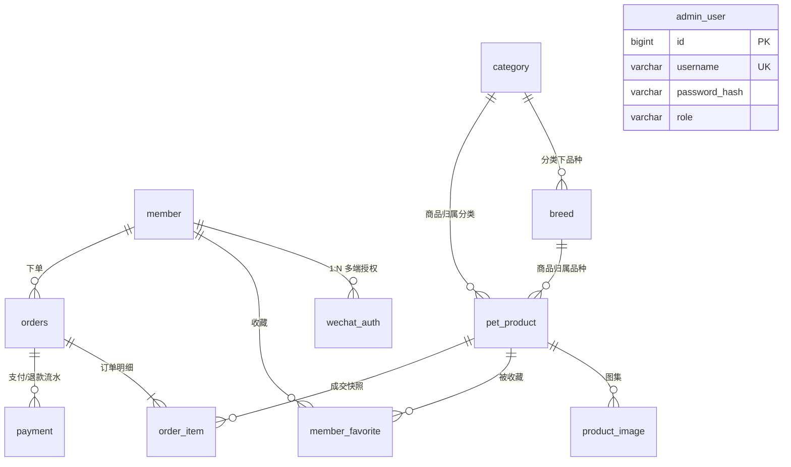

# 03 - 数据库设计（PostgreSQL）

> 宠物交易平台 · 数据库设计文档 · PostgreSQL 16+

## 1. 设计约定

| 约定 | 说明 |
| ---- | ---- |
| 主键 | `BIGINT`，应用层雪花 ID 生成（与现有体系一致，利于分库与导出安全） |
| 金额 | `NUMERIC(10,2)`，禁止 float/double |
| 时间 | `TIMESTAMPTZ`（UTC 存储，展示层按东八区渲染） |
| 命名 | 表/字段小写下划线；表名单数 |
| 字符集 | `UTF8`（PG 默认），排序规则 `zh_CN.UTF-8` 或 `C` |
| 软删除 | 一期不做全表软删，仅订单/商品用状态位表达生命周期 |
| 迁移 | golang-migrate 管理版本化 SQL（`scripts/sql/migrations/`，与业务代码分离） |

## 2. ER 图



## 3. 表结构 DDL

### 3.1 会员表 `member`（用户端账号）

```sql
CREATE TABLE member (
    id          BIGINT PRIMARY KEY,
    nickname    VARCHAR(64)  NOT NULL DEFAULT '',
    avatar      VARCHAR(512) NOT NULL DEFAULT '',
    phone       VARCHAR(20)  NOT NULL DEFAULT '',      -- 短信验证码登录凭证 / 触达用
    gender      SMALLINT     NOT NULL DEFAULT 0,       -- 0未知 1男 2女
    status      SMALLINT     NOT NULL DEFAULT 1,       -- 1正常 2禁用
    last_login_at TIMESTAMPTZ,
    created_at  TIMESTAMPTZ  NOT NULL DEFAULT now(),
    updated_at  TIMESTAMPTZ  NOT NULL DEFAULT now()
);
CREATE UNIQUE INDEX uk_member_phone ON member (phone) WHERE phone <> '';  -- 手机号登录凭证：一人一号
```

### 3.2 微信授权表 `wechat_auth`（多端 openid 归并）

```sql
CREATE TABLE wechat_auth (
    id          BIGINT PRIMARY KEY,
    member_id   BIGINT       NOT NULL,
    app_type    SMALLINT     NOT NULL,        -- 1小程序 2公众号H5 3App开放平台
    openid      VARCHAR(64)  NOT NULL,
    unionid     VARCHAR(64)  NOT NULL DEFAULT '',
    session_key VARCHAR(128) NOT NULL DEFAULT '',-- 小程序解密用，勿外泄
    created_at  TIMESTAMPTZ  NOT NULL DEFAULT now(),
    UNIQUE (app_type, openid)
);
CREATE INDEX idx_wechat_auth_unionid ON wechat_auth (unionid) WHERE unionid <> '';
CREATE INDEX idx_wechat_auth_member ON wechat_auth (member_id);
```

> 同一 unionid 多端登录 → 查到已有 member 则绑定新 app_type，实现小程序/H5/未来 App 同一账号。

### 3.3 平台用户表 `admin_user`

```sql
CREATE TABLE admin_user (
    id            BIGINT PRIMARY KEY,
    username      VARCHAR(32)  NOT NULL UNIQUE,
    password_hash VARCHAR(128) NOT NULL,          -- bcrypt
    nickname      VARCHAR(64)  NOT NULL DEFAULT '',
    role          VARCHAR(20)  NOT NULL DEFAULT 'operator',  -- super_admin / operator
    status        SMALLINT     NOT NULL DEFAULT 1,
    last_login_at TIMESTAMPTZ,
    created_at    TIMESTAMPTZ  NOT NULL DEFAULT now(),
    updated_at    TIMESTAMPTZ  NOT NULL DEFAULT now()
);
```

### 3.4 宠物分类 `category`

```sql
CREATE TABLE category (
    id         BIGINT PRIMARY KEY,
    name       VARCHAR(32)  NOT NULL,             -- 猫 / 狗 / 鸟 / 异宠…
    icon       VARCHAR(512) NOT NULL DEFAULT '',
    sort       INT          NOT NULL DEFAULT 0,
    status     SMALLINT     NOT NULL DEFAULT 1,   -- 1启用 0禁用
    created_at TIMESTAMPTZ  NOT NULL DEFAULT now(),
    updated_at TIMESTAMPTZ  NOT NULL DEFAULT now()
);
```

### 3.5 宠物品种 `breed`

```sql
CREATE TABLE breed (
    id          BIGINT PRIMARY KEY,
    category_id BIGINT       NOT NULL,
    name        VARCHAR(64)  NOT NULL,            -- 布偶猫 / 金毛寻回犬…
    intro       TEXT         NOT NULL DEFAULT '', -- 品种介绍（详情页品种卡片）
    cover       VARCHAR(512) NOT NULL DEFAULT '',
    sort        INT          NOT NULL DEFAULT 0,
    status      SMALLINT     NOT NULL DEFAULT 1,
    created_at  TIMESTAMPTZ  NOT NULL DEFAULT now(),
    updated_at  TIMESTAMPTZ  NOT NULL DEFAULT now(),
    FOREIGN KEY (category_id) REFERENCES category (id)
);
CREATE INDEX idx_breed_category ON breed (category_id, sort);
```

### 3.6 宠物商品 `pet_product`（核心表，SPU = 一只在售宠物）

```sql
CREATE TABLE pet_product (
    id             BIGINT PRIMARY KEY,
    spu_no         VARCHAR(32)   NOT NULL UNIQUE,
    title          VARCHAR(128)  NOT NULL,
    category_id    BIGINT        NOT NULL,
    breed_id       BIGINT        NOT NULL,
    price          NUMERIC(10,2) NOT NULL,
    original_price NUMERIC(10,2) NOT NULL DEFAULT 0,
    status         SMALLINT      NOT NULL DEFAULT 0,
    -- status: 0草稿 1在售 2下架 3锁定(已下单待支付) 4已售出
    -- ── 宠物档案（详情页信息卡）──
    pet_gender     SMALLINT      NOT NULL DEFAULT 0,   -- 0未知 1公 2母
    birth_date     DATE,
    vaccine_desc   VARCHAR(255)  NOT NULL DEFAULT '',  -- 如"三针疫苗已齐"
    deworm_desc    VARCHAR(255)  NOT NULL DEFAULT '',  -- 如"体内外驱虫已完成"
    body_type      VARCHAR(20)   NOT NULL DEFAULT '',  -- 小型/中型/大型
    coat_color     VARCHAR(32)   NOT NULL DEFAULT '',
    personality    VARCHAR(255)  NOT NULL DEFAULT '',  -- 如"黏人安静，亲人"
    health_desc    TEXT          NOT NULL DEFAULT '',  -- 健康承诺/证书说明
    -- ── 媒体 ──
    main_image     VARCHAR(512)  NOT NULL DEFAULT '',
    video_url      VARCHAR(512)  NOT NULL DEFAULT '',  -- 宠物视频(COS+CDN)
    video_cover    VARCHAR(512)  NOT NULL DEFAULT '',
    detail_html    TEXT          NOT NULL DEFAULT '',  -- 图文详情富文本
    -- ── 统计 ──
    stock          INT           NOT NULL DEFAULT 1,   -- 活体恒为1
    sales          INT           NOT NULL DEFAULT 0,
    view_count     INT           NOT NULL DEFAULT 0,
    favorite_count INT           NOT NULL DEFAULT 0,
    created_at     TIMESTAMPTZ   NOT NULL DEFAULT now(),
    updated_at     TIMESTAMPTZ   NOT NULL DEFAULT now()
);
CREATE INDEX idx_product_category ON pet_product (category_id, status);
CREATE INDEX idx_product_breed    ON pet_product (breed_id, status);
CREATE INDEX idx_product_list     ON pet_product (status, created_at DESC);
CREATE INDEX idx_product_hot      ON pet_product (status, sales DESC);
```

### 3.7 商品图集 `product_image`

```sql
CREATE TABLE product_image (
    id         BIGINT PRIMARY KEY,
    product_id BIGINT       NOT NULL,
    url        VARCHAR(512) NOT NULL,
    sort       INT          NOT NULL DEFAULT 0,
    FOREIGN KEY (product_id) REFERENCES pet_product (id)
);
CREATE INDEX idx_product_image_product ON product_image (product_id, sort);
```

### 3.8 收藏表 `member_favorite`（对应 R4）

```sql
CREATE TABLE member_favorite (
    id         BIGINT PRIMARY KEY,
    member_id  BIGINT      NOT NULL,
    product_id BIGINT      NOT NULL,
    created_at TIMESTAMPTZ NOT NULL DEFAULT now(),
    UNIQUE (member_id, product_id)          -- 去重 + 取消收藏幂等
);
CREATE INDEX idx_favorite_member ON member_favorite (member_id, created_at DESC);
```

### 3.9 订单表 `orders`

```sql
CREATE TABLE orders (
    id              BIGINT PRIMARY KEY,
    order_no        VARCHAR(32)   NOT NULL UNIQUE,   -- 雪花ID生成的业务单号
    member_id       BIGINT        NOT NULL,
    total_amount    NUMERIC(10,2) NOT NULL,          -- 商品价 + 增值服务费
    discount_amount NUMERIC(10,2) NOT NULL DEFAULT 0,-- 券抵扣
    service_fee     NUMERIC(10,2) NOT NULL DEFAULT 0,-- 增值服务费合计
    pay_amount      NUMERIC(10,2) NOT NULL,          -- 实付 = total - discount（保底0.01）
    coupon_id       BIGINT NULL,                     -- member_coupon.id
    coupon_info     VARCHAR(128)  NOT NULL DEFAULT '',-- 券名快照
    service_items   TEXT          NOT NULL DEFAULT '',-- 服务快照 JSON [{id,name,price}]
    status          SMALLINT      NOT NULL DEFAULT 10,
    -- 10待支付 20已支付 30已完成 40已取消 45已关闭(超时) 50退款中 60已退款
    contact_name    VARCHAR(32)   NOT NULL DEFAULT '',
    contact_phone   VARCHAR(20)   NOT NULL DEFAULT '',
    remark          VARCHAR(255)  NOT NULL DEFAULT '',
    paid_at         TIMESTAMPTZ,
    completed_at    TIMESTAMPTZ,
    canceled_at     TIMESTAMPTZ,
    cancel_reason   VARCHAR(255)  NOT NULL DEFAULT '',
    expire_at       TIMESTAMPTZ   NOT NULL,           -- 支付截止时间(创建+30min)
    created_at      TIMESTAMPTZ   NOT NULL DEFAULT now(),
    updated_at      TIMESTAMPTZ   NOT NULL DEFAULT now()
);
CREATE INDEX idx_order_member ON orders (member_id, status, created_at DESC);
CREATE INDEX idx_order_expire ON orders (status, expire_at) WHERE status = 10;  -- 超时关单扫描
```

### 3.10 订单明细 `order_item`（商品成交快照，防改价影响历史订单）

```sql
CREATE TABLE order_item (
    id            BIGINT PRIMARY KEY,
    order_id      BIGINT        NOT NULL,
    product_id    BIGINT        NOT NULL,
    product_title VARCHAR(128)  NOT NULL,
    product_image VARCHAR(512)  NOT NULL DEFAULT '',
    breed_name    VARCHAR(64)   NOT NULL DEFAULT '',
    price         NUMERIC(10,2) NOT NULL,
    quantity      INT           NOT NULL DEFAULT 1,
    FOREIGN KEY (order_id) REFERENCES orders (id)
);
CREATE INDEX idx_order_item_order   ON order_item (order_id);
CREATE INDEX idx_order_item_product ON order_item (product_id);
```

### 3.11 支付流水 `payment`

```sql
CREATE TABLE payment (
    id             BIGINT PRIMARY KEY,
    payment_no     VARCHAR(32)   NOT NULL UNIQUE,   -- 商户订单号(out_trade_no)
    order_id       BIGINT        NOT NULL,
    order_no       VARCHAR(32)   NOT NULL,
    member_id      BIGINT        NOT NULL,
    amount         NUMERIC(10,2) NOT NULL,
    channel        SMALLINT      NOT NULL,          -- 1小程序JSAPI 2公众号JSAPI 3H5支付
    pay_type       SMALLINT      NOT NULL DEFAULT 1,-- 1支付 2退款
    transaction_id VARCHAR(64)   NOT NULL DEFAULT '',-- 微信支付单号
    status         SMALLINT      NOT NULL DEFAULT 0,-- 0待支付 1成功 2失败 3已退款
    callback_at    TIMESTAMPTZ,
    raw_notify     TEXT          NOT NULL DEFAULT '',-- 回调原始报文(审计)
    created_at     TIMESTAMPTZ   NOT NULL DEFAULT now(),
    UNIQUE (order_no, pay_type)                     -- 回调幂等键
);
CREATE INDEX idx_payment_transaction ON payment (transaction_id);
CREATE INDEX idx_payment_member ON payment (member_id, created_at DESC);
```

### 3.12 AI 知识库 `ai_knowledge`（AI 客服 RAG 检索源，迁移 003）

```sql
CREATE TABLE ai_knowledge (
    id         BIGINT PRIMARY KEY,
    breed_id   BIGINT NULL REFERENCES breed(id),  -- NULL = 平台通用知识
    title      VARCHAR(128) NOT NULL,
    keywords   VARCHAR(255) NOT NULL DEFAULT '',  -- 逗号分隔，问答检索命中加权
    content    TEXT NOT NULL,
    sort       INT NOT NULL DEFAULT 0,
    status     SMALLINT NOT NULL DEFAULT 1,       -- 1启用 0停用
    created_at TIMESTAMPTZ NOT NULL DEFAULT now(),
    updated_at TIMESTAMPTZ NOT NULL DEFAULT now()
);
CREATE INDEX idx_ai_knowledge_breed ON ai_knowledge(breed_id) WHERE status = 1;
```

### 3.13 增值服务 `service_item`（订单加购项，迁移 004）

```sql
CREATE TABLE service_item (
    id             BIGINT PRIMARY KEY,
    name           VARCHAR(64) NOT NULL,
    description    VARCHAR(255) NOT NULL DEFAULT '',
    original_price NUMERIC(10,2) NOT NULL DEFAULT 0, -- 原价（划线展示）
    price          NUMERIC(10,2) NOT NULL,           -- 服务价（下单按此计费）
    sort           INT NOT NULL DEFAULT 0,
    status         SMALLINT NOT NULL DEFAULT 1,
    created_at     TIMESTAMPTZ NOT NULL DEFAULT now(),
    updated_at     TIMESTAMPTZ NOT NULL DEFAULT now()
);
```

### 3.14 优惠券模板 `coupon_template`（迁移 004）

```sql
CREATE TABLE coupon_template (
    id                  BIGINT PRIMARY KEY,
    name                VARCHAR(64) NOT NULL,
    type                SMALLINT NOT NULL,           -- 1满减 2折扣 3无门槛立减
    threshold_amount    NUMERIC(10,2) NOT NULL DEFAULT 0, -- 满减门槛（type=1）
    discount_amount     NUMERIC(10,2) NOT NULL DEFAULT 0, -- 满减/立减金额
    discount_percent    INT NOT NULL DEFAULT 0,      -- 折扣（type=2，90=9折）
    max_discount_amount NUMERIC(10,2) NOT NULL DEFAULT 0, -- 折扣上限（type=2，0=不封顶）
    total_count         INT NOT NULL DEFAULT 0,      -- 发放总量，0=不限
    issued_count        INT NOT NULL DEFAULT 0,      -- 已发放（领取/发放时 CAS 自增）
    per_limit           INT NOT NULL DEFAULT 1,      -- 每人限领
    new_user_only       SMALLINT NOT NULL DEFAULT 0, -- 1=注册自动赠送
    pickup_start        TIMESTAMPTZ,                 -- 可领时段（NULL 不限）
    pickup_end          TIMESTAMPTZ,
    valid_start         TIMESTAMPTZ,                 -- 可用时段（NULL 不限）
    valid_end           TIMESTAMPTZ,
    status              SMALLINT NOT NULL DEFAULT 1,
    created_at          TIMESTAMPTZ NOT NULL DEFAULT now(),
    updated_at          TIMESTAMPTZ NOT NULL DEFAULT now()
);
CREATE INDEX idx_coupon_template_status ON coupon_template(status);
```

### 3.15 用户券 `member_coupon`（迁移 004）

```sql
CREATE TABLE member_coupon (
    id          BIGINT PRIMARY KEY,
    member_id   BIGINT NOT NULL REFERENCES member(id),
    template_id BIGINT NOT NULL REFERENCES coupon_template(id),
    status      SMALLINT NOT NULL DEFAULT 1,
    -- 1可用 2已锁定(待支付订单) 3已使用 4已过期 5已作废
    order_id    BIGINT NULL,          -- 锁定/核销时的订单
    received_at TIMESTAMPTZ NOT NULL DEFAULT now(),
    used_at     TIMESTAMPTZ
);
CREATE INDEX idx_member_coupon_member ON member_coupon(member_id, status);
CREATE INDEX idx_member_coupon_order  ON member_coupon(order_id);
```

## 4. 关键数据流说明

### 4.1 下单事务（活体防超卖 + 用券）

```sql
BEGIN;
-- 1. 原子占位：只有"在售"才能被锁定（事务外先行，失败补偿释放）
UPDATE pet_product SET status = 3, updated_at = now()
 WHERE id = $1 AND status = 1;            -- 影响行数=0 → 返回"已被下单"
-- 2. 用券：原子锁定（并发用同一张券只有一单成功），回滚整个事务返回 41401
UPDATE member_coupon SET status = 2, order_id = $2
 WHERE id = $3 AND member_id = $4 AND status = 1
   AND NOT EXISTS (SELECT 1 FROM coupon_template t
                   WHERE t.id = member_coupon.template_id
                     AND t.valid_end IS NOT NULL AND t.valid_end < now());
-- 3. 创建订单 + 明细（total = 商品价 + 服务费；pay = total - 券抵扣，保底 0.01）
INSERT INTO orders (...) , INSERT INTO order_item (...);
-- 4. 创建支付流水（待支付，amount = 实付）
INSERT INTO payment (...);
COMMIT;
```

取消/超时关单的补偿事务：`orders.status → 40/45`，`pet_product.status: 3 → 1`（释放回在售），锁定券回滚——未过期回 `1 可用`、已过期置 `4`。支付成功落账事务内核销：锁定券 `2 → 3 已使用`。退款不回券。

### 4.2 收藏计数一致性

- 写路径：`INSERT/DELETE member_favorite` + 同事务更新 `pet_product.favorite_count`；
- 读路径：详情页收藏数走 Redis 缓存（`fav:count:{productId}`，TTL 60s），容忍秒级延迟；
- 详情页「我是否收藏」由前端持有收藏列表或 `GET /products/:id` 附带 `is_favorite` 字段（按 member_id 查询）。

## 5. 容量与索引预估

| 表 | 增长预估 | 索引策略 |
| -- | -------- | -------- |
| pet_product | 万级 | 状态+分类/品种组合索引覆盖列表筛选 |
| orders / payment | 日千级，年百万级 | member 维度组合索引；`(status, expire_at)` 部分索引扫描待关单 |
| member_favorite | 万级 | 唯一约束 + 成员时间索引 |
| 单表超过 5000 万再考虑分区/归档 | — | 一期不做 |

## 6. 初始化数据（种子）

- `admin_user`：内置 super_admin `admin/admin123456`（bcrypt）；
- `category`：猫 / 狗 / 鸟 / 水族 / 爬宠 / 兔子；
- 品种与商品由平台端录入；
- `ai_knowledge`（003）：平台通用 3 条 + 布偶/英短/金毛/柯基/玄凤品种专属各 1-2 条；
- `service_item`（004）：专业托运（原价300/现价200）、半年健康保障（原价199/现价99）；
- `coupon_template`（004）：新人立减券（立减30，注册赠送）、满1000减100券（总量500）、全场9折券（上限200，总量200）。
