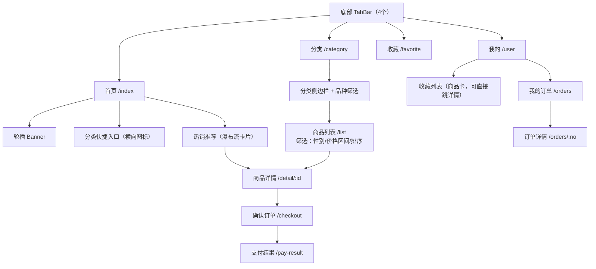

# 05 - 前端设计

> 宠物交易平台 · 前端架构与 UI 设计文档

## 1. 工程结构（frontend/ · pnpm + turbo workspace）

前端工程集中在仓库 `frontend/` 目录，自身是一个独立的 pnpm + turbo workspace：

```
frontend/
├── package.json                 # workspace 根，turbo 任务编排
├── pnpm-workspace.yaml
├── turbo.json
├── apps/
│   ├── mobile/                  # Taro 4 + React：微信小程序 + H5
│   │   ├── src/
│   │   │   ├── pages/           # 页面（见 §2.2）
│   │   │   ├── components/      # 业务组件（PetCard / VideoHero / FavoriteButton…）
│   │   │   ├── api/             # 接口定义 + Taro.request 封装（携带/刷新token）
│   │   │   ├── store/           # zustand（user / token）
│   │   │   ├── hooks/           # useFavorite / usePay / useWechatAuth
│   │   │   ├── styles/          # tailwind.config + 设计 token 变量
│   │   │   └── app.config.ts    # 多端条件编译配置
│   │   └── project.config.json  # 微信小程序配置
│   └── admin/                   # 平台管理端：React 19 + Vite + antd 5
│       └── src/
│           ├── layouts/         # ProLayout（侧边菜单）
│           ├── pages/           # dashboard / product / category-breed / order / member
│           ├── components/      # 复用 packages/ui
│           └── api/             # axios + react-query
└── packages/                    # @pet/api（接口类型）、@pet/utils、@pet/ui
```

与 `backend/`、`scripts/` 完全分离：前端不含任何 Go/SQL/部署文件；接口契约以 `packages/api` 中的 TS 类型为唯一同步点。

**多端差异处理**（Taro 条件编译）：

| 差异点 | 小程序 | H5 |
| ------ | ------ | -- |
| 登录 | `wx.login` code 登录；或手机号验证码登录 | 微信 OAuth 跳转（微信内）；手机号验证码登录（外部浏览器/兜底） |
| 支付 | `Taro.requestPayment` | `h5PayUrl` 302 跳转微信收银台 |
| 分享 | `useShareAppMessage` | `navigator.share` / 复制链接 |
| 视频播放 | `video` 组件（同层渲染） | H5 `video` 标签 + 内联播放 |

---

## 2. 移动端页面设计

### 2.1 信息架构与 TabBar



### 2.2 页面清单与要点

| 页面 | 路由 | 设计要点 |
| ---- | ---- | -------- |
| 首页 | `/index` | 沉浸式顶部（品牌色渐变）+ 大图卡片瀑布流；骨架屏 |
| 分类 | `/category` | 左侧分类导航 + 右侧品种宫格（带封面图） |
| 列表 | `/list` | 顶部品种胶囊筛选 + 性别/价格/排序抽屉；下拉刷新、上滑加载 |
| **商品详情** | `/detail/:id` | **核心页**：视频/头图轮播（自动播放静音视频，点击出声）→ 价格卡 → 宠物档案信息卡（性别/月龄/疫苗/驱虫图标化）→ 品种介绍卡 → 图文详情 → 底部操作栏（收藏♥ / 联系客服 / 立即购买）；档案卡下方为**用户评价区**（均分 + 最新 3 条 + 「全部评价」半屏弹层，游标加载、图片预览） |
| 确认订单 | `/checkout` | 商品卡 + 联系人表单 + 费用明细 + 支付按钮 |
| 支付结果 | `/pay-result` | 成功动效 + 查看订单/返回首页 |
| 我的订单 | `/orders` | 状态 chips：全部/待支付/已支付/已完成/已退款；按状态出操作——去支付、确认收货、申请售后、撤销售后、去评价/已评价；小程序端在按钮点击内同步请求订阅消息授权（模板 ID 进页预取） |
| 订单评价 | `/order-review?orderNo=` | 星级自绘 + 文字（≤500 字）+ 图片墙（COS 直传，≤9 张），提交后返回订单页 |
| 售后服务 | `/after-sale?orderNo=` | 无售后：发起表单（原因 textarea，默认全额原路退回说明）；有售后：状态卡（状态胶囊色 / 金额 / 平台备注）+ 待审核可撤销 |
| 收藏 | `/favorite` | 网格卡片 + 取消收藏手势/按钮 |
| 我的 | `/user` | 头像昵称卡 + 订单入口 + 收藏入口 + 联系客服 |
| 登录 | `/login` | 微信一键登录（小程序）为主，可切换「手机号 + 验证码」；60s 倒计时发送按钮；测试/开发环境展示公共验证码提示 |
| 在线客服 | `/service-chat` | 人工客服聊天：气泡流（文本 / 图片预览）、乐观发送 + 失败重试、断线状态条；连接管理收敛在 `src/ws.ts`（退避重连 / 45s 判死自愈 / `?after=` 补拉） |

### 2.3 关键技术方案

| 主题 | 方案 |
| ---- | ---- |
| 视频播放 | Taro `<Video>` 组件；列表不渲染 video（性能），详情页渲染；`poster` 封面 + 点击播放；小程序端 `play-gesture`、H5 `playsinline` |
| 图片优化 | COS 图片处理参数（缩略/压缩/WebP），CDN 域名统一配置；`image` 懒加载 |
| 登录态 | zustand 持久化 token；`Taro.request` 拦截器 401 自动 refresh 重放（单飞防并发刷新） |
| 支付轮询 | react-query `refetchInterval` 2s×15 次查 `/payments/:no/status`，超时提示「支付结果确认中」 |
| 收藏交互 | 乐观更新（本地先变，失败回滚 + Toast），心形缩放动效 |
| 分享 | 详情页配置小程序分享卡片（主图+标题+价格）；H5 配置 OG meta + 微信 JS-SDK 分享（可选） |

---

## 3. UI 设计规范（对应需求「美观、吸引用户」）

### 3.1 设计基调

活体宠物交易 = **情感消费**，设计原则：**大图优先、温暖亲和、信息可信**。

| Token | 值 | 说明 |
| ----- | -- | ---- |
| 主色 | `#FF7A45`（活力珊瑚橙） | 品牌色：按钮、价格、选中态 |
| 辅色 | `#FFD666`（暖黄） | 标签/角标（如「疫苗齐全」） |
| 强调 | `#FA541C` | 价格数字 |
| 中性色 | `#262626 / #8C8C8C / #F5F5F5` | 标题 / 次要 / 背景 |
| 成功/警示 | `#52C41A / #FF4D4F` | 状态 |
| 圆角 | 卡片 `16rpx`、按钮 `999rpx`(胶囊) | 圆润亲和 |
| 字体 | 标题 34rpx 粗 / 正文 28rpx / 辅助 24rpx | 价格用 DIN/等宽数字 |
| 间距 | 8 的倍数（16/24/32rpx） | 卡片留白充足 |
| 阴影 | `0 4rpx 16rpx rgba(0,0,0,0.06)` | 轻浮层感 |

### 3.2 核心组件样式约定

- **宠物卡片（PetCard）**：主图 3:4 圆角上圆下直 → 标题单行 → 品种/性别/月龄标签行（浅色胶囊）→ 价格行（红橙色大数字 + 原价划线）；
- **档案信息卡**：2×3 图标网格（性别/月龄/疫苗/驱虫/体型/毛色），icon + 短文案，可信信息前置；
- **标签体系**：`疫苗齐全` `包健康` `证书齐全` `已驱虫` —— 黄底深字胶囊，建立信任；
- **详情页底栏**：左侧收藏（心形）+ 客服（button open-type=contact），右侧主按钮「立即购买」渐变橙；
- **空状态/加载**：爪印插画空状态、骨架屏统一组件。

### 3.3 开源参考清单（建议阅读的 UI/源码）

| 项目 | 参考点 |
| ---- | ------ |
| **NutUI-React**（github.com/jdf2e/nutui-react） | 主组件库直接使用；商品/SKU/地址/瀑布流组件源码 |
| **Taroify**（github.com/mallfoundry/taroify） | 补充组件、动效细节 |
| **TDesign Mobile React**（github.com/Tencent/tdesign-react） | 设计 Token 规范（色彩/圆角/字阶体系） |
| **Ant Design Mobile**（github.com/ant-design/ant-design-mobile） | 表单、动作面板交互规范 |
| **shadcn/ui**（ui.shadcn.com） | 设计趋势：卡片化、留白、细腻描边（管理端可选借鉴） |
| **Ant Design Pro**（pro.ant.design） | 平台端布局与 CRUD 模板（ProTable/ProForm） |
| **SoybeanAdmin / Vben Admin** | 管理端设计感参考（非必选） |

---

## 4. 平台管理端设计（PC）

### 4.1 布局与页面

ProLayout 经典后台布局（侧边菜单 + 顶栏 + 内容区），页面清单：

| 菜单 | 页面 | 核心组件 |
| ---- | ---- | -------- |
| 数据看板 | `/dashboard` | StatisticCard ×4（在售/今日订单/GMV/会员）+ 趋势图（@ant-design/charts） |
| 宠物管理 | `/products` | ProTable 列表（缩略图列、状态 Tag、行内上下架）+ Drawer/Modal 表单 |
| 商品编辑 | `/products/edit` | 分组表单：基础信息 / 宠物档案 / 媒体上传（图片墙+视频上传，COS 直传）/ 富文本详情（wangEditor） |
| 分类品种 | `/categories`、`/breeds` | 表格 CRUD，品种页带分类级联 |
| 订单管理 | `/orders` | ProTable（状态 Tab、退款操作二次确认、导出） |
| 售后管理 | `/aftersale` | 状态 Tabs（全部/待审核/已同意/已拒绝/已撤销）+ 审核弹窗：同意→金额 InputNumber（默认全额可调）+ 备注；拒绝→备注必填 |
| 评价管理 | `/reviews` | 游标加载列表（星级 / 内容 / 图片预览 / 会员 / 商品）+ 显示隐藏 Switch + 删除 Popconfirm |
| 会员管理 | `/members` | 列表 + 禁用操作 |
| 人工客服 | `/support` | 左会话列表（未读 Badge / 预览 / 状态）+ 右聊天面板（图片预览、结束会话） |
| 系统设置 | `/settings` | 管理员密码、轮播位配置（预留） |

### 4.2 要点

- 共享逻辑沉淀到 `packages/`（`@pet/api` / `@pet/utils` / `@pet/ui`）：axios 实例 + react-query + zod 校验统一封装；
- 媒体上传：组件先调 `/media/upload-token` 拿 COS 临时凭证 → 前端直传 COS → 回传 URL；
- 退款操作必须二次确认 + 填写原因（操作审计入 payment.raw_notify 与操作日志）；
- 路由守卫：无 token / token 过期跳登录页；角色为 `operator` 时隐藏会员管理与退款入口（预留）。

---

## 5. 前端质量保障

| 项 | 方案 |
| -- | ---- |
| 代码规范 | ESLint + Prettier + husky + lint-staged（与现有 monorepo 一致） |
| 类型安全 | TS strict；接口类型由后端 types 同步手写（二期可用 openapi 生成） |
| 提交规范 | commitlint（conventional commits） |
| 构建产物 | 小程序：`taro build --type weapp` → 微信开发者工具上传 / miniprogram-ci；H5：静态产物 → Nginx；管理端：vite build → Nginx |
| 联调环境 | dev（本地后端）/ test（测试环境）/ prod 三套 `.env` + Taro `--mode` |
